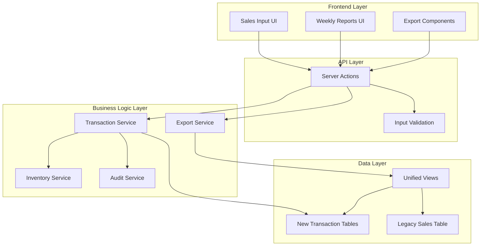
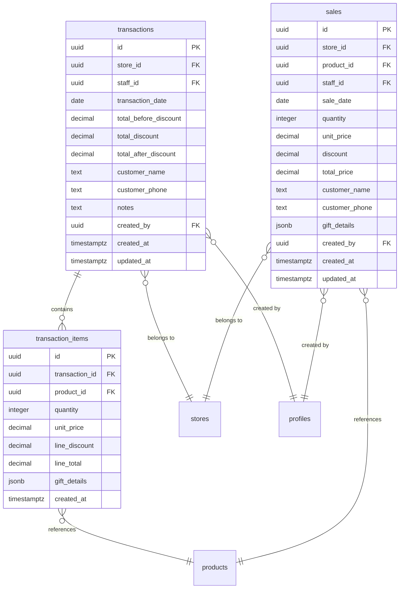

# Multi-Product Sales Transactions - Design Document

## Overview

This design transforms the current single-product sales system into a comprehensive multi-product transaction system while maintaining full backward compatibility. The system will enable staff to create complete transactions containing multiple products, generate professional invoices, and export individual transactions from reports using the existing Excel/PDF format structure.

The design maintains the current user experience and export formats while introducing a proper transaction-based data model that aligns with real-world business processes. All existing functionality continues to work unchanged, with legacy sales records seamlessly integrated into the new transaction system.

## Architecture

### High-Level Architecture

The system follows a layered architecture with clear separation of concerns:



### Database Architecture

The new transaction-based architecture introduces two new tables while preserving the existing `sales` table for backward compatibility:



## Components and Interfaces

### 1. Transaction Management Components

#### TransactionInput Component
- **Purpose**: Multi-product transaction creation interface
- **Location**: `src/components/sales/TransactionInput.tsx`
- **Features**:
  - Product search and selection
  - Quantity and pricing input
  - Real-time total calculation
  - Customer information capture
  - Gift product management

#### TransactionList Component
- **Purpose**: Display and manage existing transactions
- **Location**: `src/components/sales/TransactionList.tsx`
- **Features**:
  - Transaction search and filtering
  - Transaction detail view
  - Individual transaction export
  - Transaction modification (admin/manager only)

### 2. Export System Components

#### TransactionExporter Component
- **Purpose**: Handle individual transaction exports
- **Location**: `src/components/exports/TransactionExporter.tsx`
- **Features**:
  - PDF generation using existing format
  - Excel generation using existing format
  - Multi-row export for multi-product transactions
  - Legacy sales record compatibility

#### WeeklyReportEnhanced Component
- **Purpose**: Enhanced weekly reports with transaction export
- **Location**: `src/app/(dashboard)/sales/weekly/page.tsx` (enhanced)
- **Features**:
  - Individual transaction export buttons
  - Transaction grouping display
  - Backward compatibility with legacy sales

### 3. Server Actions

#### Transaction Actions
- **Location**: `src/actions/transactions.ts`
- **Functions**:
  - `createTransaction(data: TransactionInput): Promise<ActionResult<Transaction>>`
  - `getTransactions(filters?: TransactionFilter): Promise<ActionResult<Transaction[]>>`
  - `getTransactionById(id: string): Promise<ActionResult<Transaction>>`
  - `updateTransaction(id: string, data: TransactionUpdate): Promise<ActionResult<Transaction>>`
  - `deleteTransaction(id: string): Promise<ActionResult<void>>`

#### Export Actions
- **Location**: `src/actions/exports.ts`
- **Functions**:
  - `exportTransactionPDF(transactionId: string): Promise<ActionResult<Blob>>`
  - `exportTransactionExcel(transactionId: string): Promise<ActionResult<Blob>>`
  - `exportMultipleTransactions(transactionIds: string[]): Promise<ActionResult<Blob>>`

### 4. Database Functions

#### Transaction Management Functions
```sql
-- Create transaction with items atomically
CREATE OR REPLACE FUNCTION create_transaction_with_items(
  p_transaction_data JSONB,
  p_items_data JSONB[]
) RETURNS UUID;

-- Get unified sales data (transactions + legacy sales)
CREATE OR REPLACE FUNCTION get_unified_sales_data(
  p_start_date DATE,
  p_end_date DATE,
  p_store_id UUID DEFAULT NULL,
  p_staff_id UUID DEFAULT NULL
) RETURNS TABLE(...);

-- Convert legacy sale to transaction format
CREATE OR REPLACE FUNCTION legacy_sale_to_transaction_format(
  p_sale_id UUID
) RETURNS TABLE(...);
```

## Data Models

### Core Transaction Types

```typescript
// New transaction types
export interface Transaction {
  id: string;
  store_id: string;
  staff_id: string;
  transaction_date: string;
  total_before_discount: number;
  total_discount: number;
  total_after_discount: number;
  inventory_source: 'in_store' | 'warehouse';
  customer_name?: string;
  customer_phone?: string;
  notes?: string;
  created_by: string;
  created_at: string;
  updated_at: string;
  items: TransactionItem[];
  store?: Store;
  staff?: Profile;
}

export interface TransactionItem {
  id: string;
  transaction_id: string;
  product_id: string;
  quantity: number;
  unit_price: number;
  line_discount: number;
  line_total: number;
  gift_details?: GiftItem[];
  created_at: string;
  product?: Product;
}

// Input/validation types
export interface TransactionInput {
  store_id: string;
  transaction_date: string;
  inventory_source: 'in_store' | 'warehouse';
  customer_name?: string;
  customer_phone?: string;
  notes?: string;
  items: TransactionItemInput[];
}

export interface TransactionItemInput {
  product_id: string;
  quantity: number;
  unit_price: number;
  line_discount?: number;
  gift_details?: GiftItem[];
}

// Unified export format (compatible with existing exports)
export interface UnifiedSalesItem {
  id: string;
  transaction_id?: string; // null for legacy sales
  sale_date: string;
  fiscal_week: number;
  fiscal_year: number;
  store_id: string;
  store_name: string;
  account_name?: string;
  staff_id: string;
  staff_name: string;
  product_id: string;
  sku: string;
  product_name: string;
  category?: string;
  sub_category?: string;
  quantity: number;
  unit_price: number;
  discount: number;
  total_price: number;
  customer_name?: string;
  customer_phone?: string;
  gift_details?: GiftItem[];
  gift?: string; // legacy field
  inventory_source: 'in_store' | 'warehouse';
}
```

### Database Schema Changes

#### New Tables

```sql
-- Transactions table
CREATE TABLE public.transactions (
  id UUID PRIMARY KEY DEFAULT gen_random_uuid(),
  store_id UUID NOT NULL REFERENCES public.stores(id) ON DELETE RESTRICT,
  staff_id UUID NOT NULL REFERENCES public.profiles(id) ON DELETE RESTRICT,
  transaction_date DATE NOT NULL,
  total_before_discount DECIMAL(15,2) NOT NULL CHECK (total_before_discount >= 0),
  total_discount DECIMAL(15,2) DEFAULT 0 CHECK (total_discount >= 0),
  total_after_discount DECIMAL(15,2) NOT NULL CHECK (total_after_discount >= 0),
  inventory_source TEXT CHECK (inventory_source IN ('in_store', 'warehouse')) DEFAULT 'in_store',
  customer_name TEXT,
  customer_phone TEXT,
  notes TEXT,
  created_by UUID REFERENCES public.profiles(id),
  created_at TIMESTAMPTZ DEFAULT NOW(),
  updated_at TIMESTAMPTZ DEFAULT NOW()
);

-- Transaction items table
CREATE TABLE public.transaction_items (
  id UUID PRIMARY KEY DEFAULT gen_random_uuid(),
  transaction_id UUID NOT NULL REFERENCES public.transactions(id) ON DELETE CASCADE,
  product_id UUID NOT NULL REFERENCES public.products(id) ON DELETE RESTRICT,
  quantity INTEGER NOT NULL CHECK (quantity > 0),
  unit_price DECIMAL(15,2) NOT NULL CHECK (unit_price >= 0),
  line_discount DECIMAL(15,2) DEFAULT 0 CHECK (line_discount >= 0),
  line_total DECIMAL(15,2) NOT NULL CHECK (line_total >= 0),
  gift_details JSONB DEFAULT '[]'::jsonb,
  created_at TIMESTAMPTZ DEFAULT NOW()
);

-- Indexes for performance
CREATE INDEX idx_transactions_store_id ON public.transactions(store_id);
CREATE INDEX idx_transactions_staff_id ON public.transactions(staff_id);
CREATE INDEX idx_transactions_date ON public.transactions(transaction_date);
CREATE INDEX idx_transactions_created_by ON public.transactions(created_by);

CREATE INDEX idx_transaction_items_transaction_id ON public.transaction_items(transaction_id);
CREATE INDEX idx_transaction_items_product_id ON public.transaction_items(product_id);

-- Audit triggers
CREATE TRIGGER audit_transactions
  AFTER INSERT OR UPDATE OR DELETE ON public.transactions
  FOR EACH ROW EXECUTE FUNCTION public.log_audit_event();

CREATE TRIGGER audit_transaction_items
  AFTER INSERT OR UPDATE OR DELETE ON public.transaction_items
  FOR EACH ROW EXECUTE FUNCTION public.log_audit_event();
```

#### Unified View for Exports

```sql
-- Unified view combining transactions and legacy sales
CREATE VIEW unified_sales_export AS
SELECT 
  -- Transaction items (new format)
  ti.id,
  t.id as transaction_id,
  t.transaction_date as sale_date,
  fc.fiscal_week,
  fc.fiscal_year,
  t.store_id,
  s.name as store_name,
  a.name as account_name,
  t.staff_id,
  p.full_name as staff_name,
  ti.product_id,
  pr.sku,
  pr.name as product_name,
  pr.category,
  pr.sub_category,
  ti.quantity,
  ti.unit_price,
  ti.line_discount as discount,
  ti.line_total as total_price,
  t.inventory_source,
  t.customer_name,
  t.customer_phone,
  ti.gift_details,
  NULL as gift, -- legacy field
  'transaction' as source_type
FROM transaction_items ti
JOIN transactions t ON ti.transaction_id = t.id
JOIN stores s ON t.store_id = s.id
JOIN accounts a ON s.account_id = a.id
JOIN profiles p ON t.staff_id = p.id
JOIN products pr ON ti.product_id = pr.id
LEFT JOIN fiscal_calendar fc ON t.transaction_date = fc.date

UNION ALL

SELECT 
  -- Legacy sales (existing format)
  ls.id,
  NULL as transaction_id,
  ls.sale_date,
  fc.fiscal_week,
  fc.fiscal_year,
  ls.store_id,
  s.name as store_name,
  a.name as account_name,
  ls.staff_id,
  p.full_name as staff_name,
  ls.product_id,
  pr.sku,
  pr.name as product_name,
  pr.category,
  pr.sub_category,
  ls.quantity,
  ls.unit_price,
  ls.discount,
  ls.total_price,
  ls.customer_name,
  ls.customer_phone,
  ls.gift_details,
  NULL as gift, -- legacy field handled in application
  COALESCE(ls.inventory_source, 'in_store') as inventory_source,
  'legacy' as source_type
FROM sales ls
JOIN stores s ON ls.store_id = s.id
JOIN accounts a ON s.account_id = a.id
JOIN profiles p ON ls.staff_id = p.id
JOIN products pr ON ls.product_id = pr.id
LEFT JOIN fiscal_calendar fc ON ls.sale_date = fc.date;
```
## Correctness Properties

*A property is a characteristic or behavior that should hold true across all valid executions of a system-essentially, a formal statement about what the system should do. Properties serve as the bridge between human-readable specifications and machine-verifiable correctness guarantees.*

Before defining the correctness properties, I need to analyze the acceptance criteria for testability:

### Property Reflection

After analyzing all acceptance criteria, I identified several areas where properties can be consolidated to eliminate redundancy:

**Consolidation Areas:**
1. **Export Format Properties**: Properties 3.1, 3.4, 5.2, 5.4 all test the same export format consistency - can be combined into one comprehensive property
2. **Legacy Data Integration**: Properties 2.1, 2.3, 4.3, 9.4 all test that legacy data is included in various operations - can be combined
3. **Transaction Validation**: Properties 8.1, 8.2, 8.3, 8.6 all test different aspects of transaction validation - can be combined into comprehensive validation property
4. **Audit Logging**: Properties 7.1, 7.2, 7.3, 7.5 all test audit logging for different events - can be combined into comprehensive audit property
5. **Inventory Management**: Properties 6.1, 6.4, 6.5 all test inventory updates - can be combined into atomic inventory management property

**Properties to Remove as Redundant:**
- Property 3.2 is subsumed by the comprehensive export format property
- Property 3.3 is subsumed by the comprehensive export format property  
- Property 5.3 is subsumed by the comprehensive export format property
- Property 8.4 is subsumed by the transaction calculation property (1.3)
- Property 4.4 is subsumed by backward compatibility properties

### Correctness Properties

### Property 1: Multi-Product Transaction Creation

*For any* valid transaction input containing multiple products, the system should successfully create a transaction with all products stored as separate transaction items, each containing correct product_id, quantity, unit_price, and line_total.

**Validates: Requirements 1.1, 1.2**

### Property 2: Transaction Total Calculation

*For any* transaction with multiple items, the calculated transaction total should equal the sum of all line totals minus any transaction-level discounts.

**Validates: Requirements 1.3**

### Property 3: Transaction Validation Rules

*For any* transaction input, the system should validate that: at least one product is included, all quantities are positive numbers, all products exist and are active, all required customer information is provided, and all product prices match current pricing rules, rejecting invalid transactions with specific error messages.

**Validates: Requirements 1.4, 8.1, 8.2, 8.3, 8.5, 8.6**

### Property 4: Unique Transaction Identification

*For any* set of transactions created in the system, each transaction should have a unique transaction_id and include proper metadata (timestamp, staff_id, customer information).

**Validates: Requirements 1.5, 1.6**

### Property 5: Legacy Data Backward Compatibility

*For any* query or operation in the system (reporting, exporting, searching), legacy sales records should be accessible and included alongside new transaction data, presented as single-item transactions.

**Validates: Requirements 2.1, 2.2, 2.3, 4.3, 9.4**

### Property 6: Data Migration Integrity

*For any* data migration operation, all original sales record information should be preserved with maintained referential integrity between legacy and new transaction data.

**Validates: Requirements 2.4, 2.5, 10.3**

### Property 7: Export Format Consistency

*For any* transaction export (individual or batch), the system should generate files using the existing Excel/PDF format structure with specified column headers (Month, DATE, Week, Account Name, Store Name, SKU, Category, Sub category, Product Name, QTY, ST, Discount, TOTAL, Gift Product 1, Gift Qty 1, Gift Product 2, Gift Qty 2), creating one row per product with repeated transaction-level information.

**Validates: Requirements 3.1, 3.2, 3.3, 3.4, 5.2, 5.4**

### Property 8: Discount Distribution in Exports

*For any* multi-product transaction export, transaction-level discounts should be distributed proportionally across product lines while maintaining correct individual line totals.

**Validates: Requirements 3.5, 5.5**

### Property 9: Export Functionality Preservation

*For any* export operation, the system should preserve existing filename conventions, support both PDF and Excel formats using current templates, and handle legacy sales records as single-row transactions.

**Validates: Requirements 3.6, 3.7, 5.6**

### Property 10: Transaction-Based Reporting

*For any* weekly report generation, the system should aggregate data by transactions (not individual products), display transaction totals, item counts, and average transaction values, while maintaining all existing report metrics and providing transaction-level details on demand.

**Validates: Requirements 4.1, 4.2, 4.5**

### Property 11: Individual Transaction Export Access

*For any* weekly report view, the system should provide export options for individual transactions that generate exports using the existing format with all transaction items included.

**Validates: Requirements 5.1**

### Property 12: Atomic Inventory Management

*For any* transaction completion, the system should atomically update stock levels for all transaction items after validating sufficient stock exists, and restore stock levels for all affected products when transactions are voided or returned.

**Validates: Requirements 6.1, 6.2, 6.4, 6.5**

### Property 13: Stock Validation Error Handling

*For any* transaction with insufficient stock for any product, the system should prevent transaction completion and display specific stock shortage information.

**Validates: Requirements 6.3**

### Property 14: Comprehensive Audit Logging

*For any* transaction event (creation, modification, void), the system should record complete audit trails with timestamps, user_id, change descriptions, and maintain transaction-level audit trails separate from individual item changes.

**Validates: Requirements 7.1, 7.2, 7.3, 7.4, 7.5**

### Property 15: Transaction Search and Retrieval

*For any* search operation, the system should provide search functionality by transaction_id, customer information, and date range, display transaction summaries in results, show complete transaction details when selected, and support filtering by transaction total, staff member, and product categories.

**Validates: Requirements 9.1, 9.2, 9.3, 9.5**

### Property 16: Database Schema Integrity

*For any* database operation, the system should maintain proper foreign key relationships between transactions, items, and products, implement proper constraints to ensure data integrity, and support rollback of schema changes if migration fails.

**Validates: Requirements 10.2, 10.5, 10.6**

## Error Handling

### Transaction Creation Errors

The system implements comprehensive error handling for transaction creation:

1. **Validation Errors**:
   - Empty transaction (no products): Return specific error message
   - Invalid quantities (zero, negative, non-numeric): Return field-specific error
   - Invalid product IDs: Return product-specific error message
   - Missing required customer information: Return field-specific error

2. **Inventory Errors**:
   - Insufficient stock: Return product-specific stock shortage information
   - Inventory update failures: Rollback entire transaction and return error

3. **Database Errors**:
   - Foreign key violations: Return user-friendly constraint error
   - Transaction rollback: Ensure atomic operations with proper cleanup
   - Connection failures: Retry logic with exponential backoff

### Export System Errors

1. **Data Retrieval Errors**:
   - Transaction not found: Return specific error message
   - Access denied: Return permission-specific error
   - Data corruption: Log error and return generic message to user

2. **File Generation Errors**:
   - PDF generation failure: Fallback to Excel format with user notification
   - Excel generation failure: Return detailed error message
   - Template loading errors: Use fallback template or return error

### Legacy Data Integration Errors

1. **Migration Errors**:
   - Data integrity violations: Halt migration and provide detailed report
   - Schema conflicts: Provide rollback option with error details
   - Performance issues: Implement batch processing with progress tracking

2. **Query Errors**:
   - Legacy data access failures: Log error and exclude from results with notification
   - Format conversion errors: Use fallback formatting with warning

## Testing Strategy

### Dual Testing Approach

The system requires both unit testing and property-based testing for comprehensive coverage:

**Unit Tests** focus on:
- Specific examples and edge cases
- Integration points between components  
- Error conditions and boundary cases
- UI component behavior and user interactions

**Property-Based Tests** focus on:
- Universal properties that hold for all inputs
- Comprehensive input coverage through randomization
- Business rule validation across all scenarios
- Data integrity and consistency checks

### Property-Based Testing Configuration

- **Testing Library**: Use `fast-check` for TypeScript/JavaScript property-based testing
- **Test Iterations**: Minimum 100 iterations per property test
- **Test Tagging**: Each property test must reference its design document property using the format: **Feature: multi-product-sales-transactions, Property {number}: {property_text}**

### Unit Testing Strategy

**Frontend Components**:
- Transaction input form validation and user interactions
- Export button functionality and file download handling
- Weekly report display and filtering
- Error message display and user feedback

**Server Actions**:
- Transaction creation with various input combinations
- Export generation with different transaction types
- Search and filtering functionality
- Error handling for various failure scenarios

**Database Operations**:
- Migration scripts with rollback testing
- Constraint validation and foreign key relationships
- Index performance and query optimization
- Audit trigger functionality

### Integration Testing

**End-to-End Workflows**:
- Complete transaction creation and export process
- Legacy data migration and backward compatibility
- Weekly report generation with mixed data types
- Multi-user concurrent transaction creation

**API Integration**:
- Server action error handling and response formatting
- Database transaction rollback scenarios
- File generation and download processes
- Audit logging across all operations

### Performance Testing

**Database Performance**:
- Query performance with large datasets
- Index effectiveness for transaction searches
- Migration performance with existing data
- Concurrent transaction creation load testing

**Export Performance**:
- Large transaction export generation
- Multiple concurrent export requests
- Memory usage during file generation
- Network transfer optimization for large files

### Security Testing

**Access Control**:
- Role-based permissions for transaction operations
- Store-level data isolation for staff users
- Audit log access restrictions
- Export functionality permission validation

**Data Integrity**:
- SQL injection prevention in search queries
- Input sanitization for transaction data
- File upload security for import operations
- Audit trail tamper protection