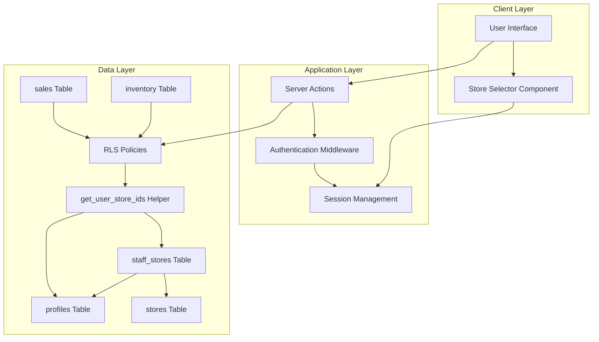
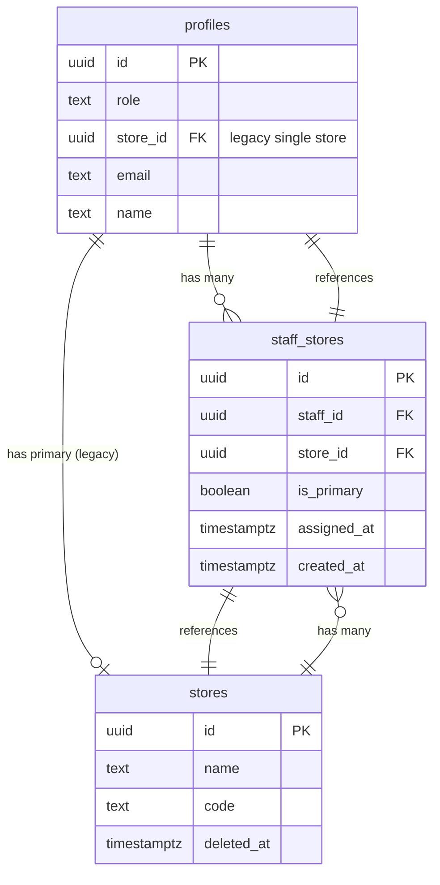

# Design Document: Multi-Store Staff Assignment

## Overview

This design implements a many-to-many relationship between staff members and stores, replacing the current one-to-one relationship. The solution uses a junction table pattern with proper indexing, RLS policies, and session management to enable staff to work across multiple store locations while maintaining data isolation and security.

The design prioritizes backward compatibility during migration, allowing the system to operate with both old (single-store via `profiles.store_id`) and new (multi-store via `staff_stores` junction table) approaches simultaneously during the transition period.

## Architecture

### High-Level Architecture



### Component Interaction Flow

1. **Authentication Flow**: User logs in → Middleware loads store assignments → Session stores assigned store IDs and primary store
2. **Store Selection Flow**: User selects store → Session updates current store context → UI refreshes with new context
3. **Data Access Flow**: User requests data → RLS checks store access via helper function → Returns only authorized data
4. **Assignment Management Flow**: Admin modifies assignments → Audit log records change → User session refreshes on next request

## Components and Interfaces

### 1. Database Schema Components

#### staff_stores Junction Table

```sql
CREATE TABLE staff_stores (
  id UUID PRIMARY KEY DEFAULT gen_random_uuid(),
  staff_id UUID NOT NULL REFERENCES profiles(id) ON DELETE CASCADE,
  store_id UUID NOT NULL REFERENCES stores(id) ON DELETE CASCADE,
  is_primary BOOLEAN NOT NULL DEFAULT false,
  assigned_at TIMESTAMPTZ NOT NULL DEFAULT now(),
  created_at TIMESTAMPTZ NOT NULL DEFAULT now(),
  CONSTRAINT unique_staff_store UNIQUE (staff_id, store_id)
);

-- Ensure each staff has exactly one primary store
CREATE UNIQUE INDEX idx_staff_primary_store 
  ON staff_stores (staff_id) 
  WHERE is_primary = true;

-- Performance indexes
CREATE INDEX idx_staff_stores_staff_id ON staff_stores(staff_id);
CREATE INDEX idx_staff_stores_store_id ON staff_stores(store_id);
```

**Design Rationale**: 
- UUID primary key for distributed system compatibility
- CASCADE delete ensures referential integrity
- Unique constraint prevents duplicate assignments
- Partial unique index enforces single primary store per staff
- Indexes optimize common query patterns (lookup by staff, lookup by store)

#### RLS Helper Function

```sql
CREATE OR REPLACE FUNCTION get_user_store_ids(user_id UUID)
RETURNS UUID[] AS $$
DECLARE
  user_role TEXT;
  store_ids UUID[];
BEGIN
  -- Get user role
  SELECT role INTO user_role FROM profiles WHERE id = user_id;
  
  -- Admin and manager see all stores
  IF user_role IN ('admin', 'manager', 'dealer') THEN
    SELECT ARRAY_AGG(id) INTO store_ids FROM stores WHERE is_active = true;
    RETURN store_ids;
  END IF;
  
  -- Staff: get assigned stores from junction table
  SELECT ARRAY_AGG(store_id) INTO store_ids 
  FROM staff_stores 
  WHERE staff_id = user_id;
  
  -- Fallback to profiles.store_id for backward compatibility
  IF store_ids IS NULL OR array_length(store_ids, 1) IS NULL THEN
    SELECT ARRAY[store_id] INTO store_ids 
    FROM profiles 
    WHERE id = user_id AND store_id IS NOT NULL;
  END IF;
  
  RETURN COALESCE(store_ids, ARRAY[]::UUID[]);
END;
$$ LANGUAGE plpgsql SECURITY DEFINER STABLE;
```

**Design Rationale**:
- Returns array for efficient IN clause usage in RLS policies
- Handles role-based access (admin/manager see all, staff see assigned)
- Fallback to `profiles.store_id` ensures backward compatibility
- SECURITY DEFINER allows function to read all data while RLS restricts caller
- STABLE optimization hint since function result doesn't change within transaction

### 2. RLS Policy Updates

#### staff_stores Table Policies

```sql
-- Staff can view their own assignments
CREATE POLICY "staff_view_own_assignments" ON staff_stores
  FOR SELECT
  USING (staff_id = auth.uid());

-- Admins can manage all assignments
CREATE POLICY "admin_manage_assignments" ON staff_stores
  FOR ALL
  USING (
    EXISTS (
      SELECT 1 FROM profiles 
      WHERE id = auth.uid() AND role = 'admin'
    )
  );
```

#### Updated Sales Table Policy Example

```sql
-- Before (single store):
CREATE POLICY "staff_view_own_store_sales" ON sales
  FOR SELECT
  USING (
    store_id = (SELECT store_id FROM profiles WHERE id = auth.uid())
  );

-- After (multi-store):
CREATE POLICY "staff_view_assigned_store_sales" ON sales
  FOR SELECT
  USING (
    store_id = ANY(get_user_store_ids(auth.uid()))
  );
```

**Design Rationale**:
- Array containment check (`= ANY()`) is efficient with proper indexes
- Centralized logic in helper function makes policy updates consistent
- Policies remain declarative and easy to audit

### 3. Session Management

#### Session Data Structure

```typescript
interface UserSession {
  userId: string;
  role: 'admin' | 'manager' | 'staff' | 'dealer';
  assignedStoreIds: string[];  // All stores user can access
  primaryStoreId: string;       // Primary store for backward compatibility
  currentStoreId: string;       // Currently selected store context
  email: string;
  name: string;
}
```

#### Middleware Enhancement

```typescript
// src/lib/supabase/middleware.ts
export async function updateSession(request: NextRequest) {
  const supabase = createServerClient(/* ... */);
  
  const { data: { user } } = await supabase.auth.getUser();
  
  if (user) {
    // Load user profile and store assignments
    const { data: profile } = await supabase
      .from('profiles')
      .select('role, store_id')
      .eq('id', user.id)
      .single();
    
    // Load store assignments
    const { data: assignments } = await supabase
      .from('staff_stores')
      .select('store_id, is_primary')
      .eq('staff_id', user.id);
    
    const assignedStoreIds = assignments?.map(a => a.store_id) || [];
    const primaryStore = assignments?.find(a => a.is_primary)?.store_id || profile?.store_id;
    
    // Store in session metadata
    await supabase.auth.updateUser({
      data: {
        assigned_store_ids: assignedStoreIds,
        primary_store_id: primaryStore,
        current_store_id: primaryStore, // Default to primary
      }
    });
  }
  
  return response;
}
```

**Design Rationale**:
- Session caching reduces database queries
- Metadata stored in JWT for stateless authentication
- Fallback to `profiles.store_id` during transition
- Current store context persists across requests

### 4. Server Actions

#### Store Assignment Actions

```typescript
// src/actions/store-assignments.ts
'use server';

export async function assignStoreToStaff(
  staffId: string,
  storeId: string,
  isPrimary: boolean = false
): Promise<ActionResult> {
  const supabase = await createClient();
  
  // Verify admin role
  const { data: { user } } = await supabase.auth.getUser();
  const { data: profile } = await supabase
    .from('profiles')
    .select('role')
    .eq('id', user?.id)
    .single();
  
  if (profile?.role !== 'admin') {
    return { success: false, error: 'Unauthorized' };
  }
  
  // If setting as primary, unset other primary flags
  if (isPrimary) {
    await supabase
      .from('staff_stores')
      .update({ is_primary: false })
      .eq('staff_id', staffId);
  }
  
  // Insert or update assignment
  const { error } = await supabase
    .from('staff_stores')
    .upsert({
      staff_id: staffId,
      store_id: storeId,
      is_primary: isPrimary,
      assigned_at: new Date().toISOString(),
    });
  
  if (error) {
    return { success: false, error: error.message };
  }
  
  // Update profiles.store_id if primary
  if (isPrimary) {
    await supabase
      .from('profiles')
      .update({ store_id: storeId })
      .eq('id', staffId);
  }
  
  // Audit log
  await logAuditEvent({
    action: 'store_assigned',
    entity_type: 'staff_store',
    entity_id: staffId,
    details: { store_id: storeId, is_primary: isPrimary },
  });
  
  return { success: true };
}

export async function removeStoreFromStaff(
  staffId: string,
  storeId: string
): Promise<ActionResult> {
  const supabase = await createClient();
  
  // Verify admin role
  const { data: { user } } = await supabase.auth.getUser();
  const { data: profile } = await supabase
    .from('profiles')
    .select('role')
    .eq('id', user?.id)
    .single();
  
  if (profile?.role !== 'admin') {
    return { success: false, error: 'Unauthorized' };
  }
  
  // Check if this is the last assignment
  const { count } = await supabase
    .from('staff_stores')
    .select('*', { count: 'exact', head: true })
    .eq('staff_id', staffId);
  
  if (count === 1) {
    return { 
      success: false, 
      error: 'Cannot remove last store assignment' 
    };
  }
  
  // Check if removing primary store
  const { data: assignment } = await supabase
    .from('staff_stores')
    .select('is_primary')
    .eq('staff_id', staffId)
    .eq('store_id', storeId)
    .single();
  
  // Delete assignment
  const { error } = await supabase
    .from('staff_stores')
    .delete()
    .eq('staff_id', staffId)
    .eq('store_id', storeId);
  
  if (error) {
    return { success: false, error: error.message };
  }
  
  // If removed primary, set another store as primary
  if (assignment?.is_primary) {
    const { data: remaining } = await supabase
      .from('staff_stores')
      .select('store_id')
      .eq('staff_id', staffId)
      .limit(1)
      .single();
    
    if (remaining) {
      await supabase
        .from('staff_stores')
        .update({ is_primary: true })
        .eq('staff_id', staffId)
        .eq('store_id', remaining.store_id);
      
      await supabase
        .from('profiles')
        .update({ store_id: remaining.store_id })
        .eq('id', staffId);
    }
  }
  
  // Audit log
  await logAuditEvent({
    action: 'store_removed',
    entity_type: 'staff_store',
    entity_id: staffId,
    details: { store_id: storeId },
  });
  
  return { success: true };
}

export async function getStaffAssignments(
  staffId: string
): Promise<StaffAssignment[]> {
  const supabase = await createClient();
  
  const { data, error } = await supabase
    .from('staff_stores')
    .select(`
      id,
      store_id,
      is_primary,
      assigned_at,
      stores (
        id,
        name,
        code
      )
    `)
    .eq('staff_id', staffId)
    .order('is_primary', { ascending: false })
    .order('assigned_at', { ascending: false });
  
  if (error) throw error;
  return data;
}
```

**Design Rationale**:
- Admin-only access enforced at action level
- Prevents removal of last store assignment
- Automatically handles primary store reassignment
- Maintains backward compatibility by updating `profiles.store_id`
- Comprehensive audit logging

#### Updated Sales Actions

```typescript
// src/actions/sales.ts
export async function createSale(data: SaleInput): Promise<ActionResult> {
  const supabase = await createClient();
  const { data: { user } } = await supabase.auth.getUser();
  
  // Validate store access
  const { data: hasAccess } = await supabase.rpc(
    'user_has_store_access',
    { user_id: user?.id, check_store_id: data.store_id }
  );
  
  if (!hasAccess) {
    return { 
      success: false, 
      error: 'You do not have access to this store' 
    };
  }
  
  // Create sale (RLS will enforce access)
  const { error } = await supabase
    .from('sales')
    .insert({
      ...data,
      created_by: user?.id,
    });
  
  if (error) {
    return { success: false, error: error.message };
  }
  
  return { success: true };
}
```

**Design Rationale**:
- Explicit validation before database operation
- Clear error messages for unauthorized access
- RLS provides defense-in-depth

### 5. UI Components

#### Store Selector Component

```typescript
// src/components/layout/StoreSelector.tsx
'use client';

import { useState, useEffect } from 'react';
import { createClient } from '@/lib/supabase/client';
import { SearchableSelect } from '@/components/ui/SearchableSelect';

interface Store {
  id: string;
  name: string;
  code: string;
}

export function StoreSelector() {
  const [stores, setStores] = useState<Store[]>([]);
  const [currentStoreId, setCurrentStoreId] = useState<string>('');
  const [loading, setLoading] = useState(true);
  
  useEffect(() => {
    loadStores();
  }, []);
  
  async function loadStores() {
    const supabase = createClient();
    
    // Get user's assigned stores
    const { data: { user } } = await supabase.auth.getUser();
    const assignedStoreIds = user?.user_metadata?.assigned_store_ids || [];
    
    if (assignedStoreIds.length <= 1) {
      // Single store - no selector needed
      setLoading(false);
      return;
    }
    
    // Load store details
    const { data } = await supabase
      .from('stores')
      .select('id, name, code')
      .in('id', assignedStoreIds)
      .order('name');
    
    setStores(data || []);
    setCurrentStoreId(user?.user_metadata?.current_store_id || '');
    setLoading(false);
  }
  
  async function handleStoreChange(storeId: string) {
    const supabase = createClient();
    
    // Update session
    await supabase.auth.updateUser({
      data: { current_store_id: storeId }
    });
    
    setCurrentStoreId(storeId);
    
    // Refresh page to reload data with new context
    window.location.reload();
  }
  
  if (loading || stores.length <= 1) {
    return null;
  }
  
  const currentStore = stores.find(s => s.id === currentStoreId);
  
  return (
    <div className="flex items-center gap-2">
      <span className="text-sm text-muted-foreground">Store:</span>
      <SearchableSelect
        value={currentStoreId}
        onChange={handleStoreChange}
        options={stores.map(s => ({
          value: s.id,
          label: `${s.name} (${s.code})`
        }))}
        placeholder="Select store"
        className="w-64"
      />
    </div>
  );
}
```

**Design Rationale**:
- Only renders for multi-store staff
- Uses existing SearchableSelect component for consistency
- Updates session and refreshes to ensure data consistency
- Clear visual indication of current store

#### Updated Sales Input Form

```typescript
// src/app/(dashboard)/sales/input/page.tsx
export default async function SalesInputPage() {
  const supabase = await createClient();
  const { data: { user } } = await supabase.auth.getUser();
  
  // Get assigned stores for dropdown
  const assignedStoreIds = user?.user_metadata?.assigned_store_ids || [];
  const { data: stores } = await supabase
    .from('stores')
    .select('id, name, code')
    .in('id', assignedStoreIds)
    .order('name');
  
  return (
    <div>
      <h1>Sales Input</h1>
      <SalesForm stores={stores || []} />
    </div>
  );
}
```

**Design Rationale**:
- Populates store dropdown with only assigned stores
- Server-side data loading ensures security
- Reuses existing form components

## Data Models

### TypeScript Interfaces

```typescript
// Staff Store Assignment
interface StaffStoreAssignment {
  id: string;
  staff_id: string;
  store_id: string;
  is_primary: boolean;
  assigned_at: string;
  created_at: string;
  stores?: {
    id: string;
    name: string;
    code: string;
  };
}

// Extended User Session
interface UserSession {
  userId: string;
  role: 'admin' | 'manager' | 'staff' | 'dealer';
  assignedStoreIds: string[];
  primaryStoreId: string;
  currentStoreId: string;
  email: string;
  name: string;
}

// Store Assignment Action Result
interface AssignmentResult {
  success: boolean;
  error?: string;
  data?: StaffStoreAssignment;
}
```

### Database Relationships



## Migration Strategy

### Phase 1: Schema Creation (Zero Downtime)

```sql
-- Create junction table
CREATE TABLE staff_stores (/* ... */);

-- Create indexes
CREATE INDEX idx_staff_stores_staff_id ON staff_stores(staff_id);
CREATE INDEX idx_staff_stores_store_id ON staff_stores(store_id);
CREATE UNIQUE INDEX idx_staff_primary_store 
  ON staff_stores (staff_id) WHERE is_primary = true;

-- Create helper function
CREATE OR REPLACE FUNCTION get_user_store_ids(/* ... */);

-- Create RLS policies
ALTER TABLE staff_stores ENABLE ROW LEVEL SECURITY;
CREATE POLICY "staff_view_own_assignments" ON staff_stores /* ... */;
CREATE POLICY "admin_manage_assignments" ON staff_stores /* ... */;
```

### Phase 2: Data Migration

```sql
-- Migrate existing single-store assignments
INSERT INTO staff_stores (staff_id, store_id, is_primary, assigned_at)
SELECT 
  id as staff_id,
  store_id,
  true as is_primary,
  created_at as assigned_at
FROM profiles
WHERE role = 'staff' 
  AND store_id IS NOT NULL
  AND NOT EXISTS (
    SELECT 1 FROM staff_stores WHERE staff_id = profiles.id
  );

-- Verify migration
DO $$
DECLARE
  missing_count INTEGER;
BEGIN
  SELECT COUNT(*) INTO missing_count
  FROM profiles
  WHERE role = 'staff' 
    AND store_id IS NOT NULL
    AND NOT EXISTS (
      SELECT 1 FROM staff_stores WHERE staff_id = profiles.id
    );
  
  IF missing_count > 0 THEN
    RAISE EXCEPTION 'Migration incomplete: % staff members not migrated', missing_count;
  END IF;
END $$;
```

### Phase 3: RLS Policy Updates

```sql
-- Update sales policies
DROP POLICY IF EXISTS "staff_view_own_store_sales" ON sales;
CREATE POLICY "staff_view_assigned_store_sales" ON sales
  FOR SELECT
  USING (store_id = ANY(get_user_store_ids(auth.uid())));

-- Update inventory policies
DROP POLICY IF EXISTS "staff_view_own_store_inventory" ON inventory;
CREATE POLICY "staff_view_assigned_store_inventory" ON inventory
  FOR SELECT
  USING (store_id = ANY(get_user_store_ids(auth.uid())));

-- Update other table policies similarly
```

### Phase 4: Application Code Updates

1. Deploy middleware changes (session management)
2. Deploy server action updates (store validation)
3. Deploy UI components (store selector)
4. Deploy admin interface (assignment management)

### Rollback Plan

```sql
-- If issues arise, rollback RLS policies
DROP POLICY IF EXISTS "staff_view_assigned_store_sales" ON sales;
CREATE POLICY "staff_view_own_store_sales" ON sales
  FOR SELECT
  USING (store_id = (SELECT store_id FROM profiles WHERE id = auth.uid()));

-- Keep staff_stores table for future retry
-- Data remains intact in profiles.store_id
```


## Correctness Properties

A property is a characteristic or behavior that should hold true across all valid executions of a system—essentially, a formal statement about what the system should do. Properties serve as the bridge between human-readable specifications and machine-verifiable correctness guarantees.

### Property Reflection

After analyzing all acceptance criteria, I identified the following redundancies:
- Requirements 2.6 is the inverse of 2.4 (access control)
- Requirements 3.5 is covered by 3.1 (migration completeness)
- Requirements 6.4 is covered by 6.1 (sale validation)
- Requirements 7.5 is covered by 7.1 (inventory access)
- Requirements 9.1 is covered by 5.2 (store display)
- Requirements 10.4, 10.5, 10.6 are covered by 4.1, 4.2, 4.4 (assignment operations)
- Requirements 11.1, 11.2 are covered by 4.7 (audit logging)
- Requirements 13.2, 13.3 are covered by 1.2, 1.3 (CASCADE delete)
- Requirements 13.4 is covered by 4.5 (last assignment prevention)
- Requirements 14.1, 14.2, 14.4, 14.5 are all covered by 3.4 (precedence and fallback)

The remaining properties provide unique validation value and will be implemented as property-based tests.

### Database Integrity Properties

**Property 1: Staff deletion cascades to assignments**
*For any* staff member with store assignments, when the staff member is deleted, all their store assignments should also be deleted automatically.
**Validates: Requirements 1.2**

**Property 2: Store deletion cascades to assignments**
*For any* store with staff assignments, when the store is deleted, all assignments to that store should be deleted automatically.
**Validates: Requirements 1.3**

**Property 3: Duplicate assignments are prevented**
*For any* staff member and store, attempting to create a duplicate assignment (same staff_id and store_id) should be rejected by the database.
**Validates: Requirements 1.4**

**Property 4: Single primary store per staff**
*For any* staff member, attempting to set multiple stores as primary should be rejected, ensuring exactly one primary store exists.
**Validates: Requirements 1.7**

### Access Control Properties

**Property 5: Staff view only own assignments**
*For any* staff member, querying the staff_stores table should return only their own assignments, not assignments of other staff members.
**Validates: Requirements 2.1**

**Property 6: Admins view all assignments**
*For any* admin user, querying the staff_stores table should return all assignments for all staff members.
**Validates: Requirements 2.2**

**Property 7: Helper function returns assigned store IDs**
*For any* staff member with store assignments, calling get_user_store_ids should return an array containing exactly their assigned store IDs.
**Validates: Requirements 2.3**

**Property 8: RLS filters data by assigned stores**
*For any* staff member, querying sales or inventory should return only records where store_id is in their assigned stores array.
**Validates: Requirements 2.4**

**Property 9: Admin and manager bypass store restrictions**
*For any* admin or manager user, querying sales or inventory should return records from all stores regardless of assignments.
**Validates: Requirements 2.5**

### Migration and Compatibility Properties

**Property 10: Backward compatibility maintained**
*For any* staff member, the profiles.store_id field should continue to exist and contain their primary store ID for backward compatibility.
**Validates: Requirements 3.3**

**Property 11: New assignments take precedence**
*For any* staff member with both staff_stores assignments and profiles.store_id set, the system should use staff_stores assignments and ignore profiles.store_id.
**Validates: Requirements 3.4**

**Property 12: Primary store syncs to profiles**
*For any* staff member, when their primary store changes in staff_stores, the profiles.store_id field should be updated to match.
**Validates: Requirements 14.3**

### Assignment Management Properties

**Property 13: Assignment creation**
*For any* valid staff member and store, an admin should be able to create an assignment that persists in the staff_stores table.
**Validates: Requirements 4.1**

**Property 14: Assignment removal**
*For any* existing assignment (that is not the last one), an admin should be able to remove it and the record should be deleted from staff_stores.
**Validates: Requirements 4.2**

**Property 15: First assignment becomes primary**
*For any* staff member with no existing assignments, when a store is assigned, it should automatically be marked as primary.
**Validates: Requirements 4.3**

**Property 16: Primary store switching**
*For any* staff member with multiple assignments, when changing which store is primary, the old primary should have is_primary=false and the new one should have is_primary=true.
**Validates: Requirements 4.4**

**Property 17: Last assignment cannot be removed**
*For any* staff member with exactly one store assignment, attempting to remove that assignment should be rejected with an error.
**Validates: Requirements 4.5**

**Property 18: Non-admin cannot modify assignments**
*For any* non-admin user, attempting to create or delete store assignments should be rejected with an authorization error.
**Validates: Requirements 4.6**

**Property 19: Assignment changes are audited**
*For any* assignment creation or removal, an audit log entry should be created with the staff_id, store_id, action, and admin_id.
**Validates: Requirements 4.7**

### Store Context Properties

**Property 20: Store context updates session**
*For any* staff member with multiple stores, when selecting a different store, the session's current_store_id should be updated to the selected store.
**Validates: Requirements 5.3**

**Property 21: Store context persists**
*For any* staff member, after setting a store context in the session, subsequent requests should maintain that context until explicitly changed.
**Validates: Requirements 5.4**

**Property 22: Default to primary store**
*For any* staff member, when no store context is set in the session, the system should default to their primary store.
**Validates: Requirements 5.6**

### Sales Access Control Properties

**Property 23: Sale creation validates store access**
*For any* staff member, attempting to create a sale for a store not in their assigned stores should be rejected with a validation error.
**Validates: Requirements 6.1**

**Property 24: Sales filtered by assigned stores**
*For any* staff member, querying sales should return only sales where store_id is in their assigned stores array.
**Validates: Requirements 6.2**

**Property 25: Sales form shows only assigned stores**
*For any* staff member, the store selector in the sales input form should contain only their assigned stores.
**Validates: Requirements 6.3**

**Property 26: Sales filtering by store**
*For any* staff member with multiple stores, applying a store filter should return only sales from the selected store(s).
**Validates: Requirements 6.5**

### Inventory Access Control Properties

**Property 27: Inventory shows all assigned stores**
*For any* staff member with multiple stores, viewing inventory without filters should show inventory from all their assigned stores.
**Validates: Requirements 7.1**

**Property 28: Inventory filtering by store**
*For any* staff member with multiple stores, applying a store filter should return only inventory from the selected store(s).
**Validates: Requirements 7.2**

**Property 29: Stock opname validates store access**
*For any* staff member, attempting to perform stock opname for a store not in their assigned stores should be rejected.
**Validates: Requirements 7.4**

### Session Management Properties

**Property 30: Authentication loads assignments**
*For any* staff member, after authentication, the session should contain all their assigned store IDs from staff_stores.
**Validates: Requirements 8.1**

**Property 31: JWT contains primary store**
*For any* staff member, the JWT metadata should include their primary store ID for backward compatibility.
**Validates: Requirements 8.2**

**Property 32: Store context updates without re-auth**
*For any* staff member, changing store context should update the session without requiring a new authentication.
**Validates: Requirements 8.3**

**Property 33: Store context validation**
*For any* request, if the session's current_store_id is not in the user's assigned stores, the request should be rejected or context reset.
**Validates: Requirements 8.4**

**Property 34: Session refreshes after assignment changes**
*For any* staff member, after their store assignments are modified, their session should reflect the new assignments on the next request.
**Validates: Requirements 8.5**

### Audit Logging Properties

**Property 35: Primary change audited**
*For any* staff member, when their primary store changes, an audit log entry should be created with both old and new primary store IDs.
**Validates: Requirements 11.3**

**Property 36: Audit entries have timestamps**
*For any* store assignment audit log entry, it should include a timestamp indicating when the change occurred.
**Validates: Requirements 11.4**

**Property 37: Admins view assignment history**
*For any* staff member, admins should be able to query and view the complete history of store assignment changes from the audit log.
**Validates: Requirements 11.5**

### Performance Properties

**Property 38: Session caches assignments**
*For any* staff member, after loading store assignments once, subsequent queries within the same session should use cached data rather than querying the database.
**Validates: Requirements 12.2**

### Edge Case Properties

**Property 39: Invalid primary store rejected**
*For any* staff member, attempting to set a store as primary when that store is not in their assignments should be rejected with a validation error.
**Validates: Requirements 13.5**

**Property 40: Invalid context resets to primary**
*For any* staff member, if their session contains a store context that is not in their assigned stores, the system should reset the context to their primary store.
**Validates: Requirements 13.6**

## Error Handling

### Validation Errors

1. **Duplicate Assignment**: Return clear error when attempting to assign the same store twice
2. **Last Assignment Removal**: Return error preventing removal of the only store assignment
3. **Invalid Store Access**: Return error when staff attempts to access non-assigned store
4. **Invalid Primary Store**: Return error when attempting to set non-assigned store as primary
5. **Multiple Primary Stores**: Database constraint prevents multiple primary stores per staff

### Authorization Errors

1. **Non-Admin Assignment Modification**: Return 403 Forbidden when non-admin attempts to modify assignments
2. **Unauthorized Store Access**: Return 403 when staff attempts to access data from non-assigned store
3. **Admin Page Access**: Return 403 when non-admin attempts to access assignment management page

### Edge Case Handling

1. **No Store Assignments**: Display error message and prevent access to store-specific features
2. **Deleted Store**: CASCADE delete automatically removes assignments
3. **Deleted Staff**: CASCADE delete automatically removes assignments
4. **Invalid Session Context**: Automatically reset to primary store
5. **Missing Primary Store**: Automatically set first assignment as primary

### Error Messages

All error messages should be:
- Clear and actionable
- Localized (support i18n)
- Logged for debugging
- User-friendly (no technical jargon for end users)

Example error messages:
```typescript
const ERROR_MESSAGES = {
  DUPLICATE_ASSIGNMENT: 'This staff member is already assigned to this store',
  LAST_ASSIGNMENT: 'Cannot remove the last store assignment. Staff must have at least one store.',
  UNAUTHORIZED_STORE: 'You do not have access to this store',
  INVALID_PRIMARY: 'Cannot set a non-assigned store as primary',
  NON_ADMIN: 'Only administrators can manage store assignments',
  NO_ASSIGNMENTS: 'You have no store assignments. Please contact your administrator.',
};
```

## Testing Strategy

### Dual Testing Approach

This feature requires both unit tests and property-based tests for comprehensive coverage:

**Unit Tests** focus on:
- Specific examples of assignment operations
- Edge cases (no assignments, single assignment, deleted entities)
- Error conditions and validation
- UI component rendering
- Integration between components

**Property-Based Tests** focus on:
- Universal properties that hold for all inputs
- Database integrity constraints
- Access control across all roles and stores
- Session management across all state transitions
- Comprehensive input coverage through randomization

### Property-Based Testing Configuration

**Library**: Use `fast-check` for TypeScript/JavaScript property-based testing

**Configuration**:
- Minimum 100 iterations per property test
- Each test references its design document property
- Tag format: `Feature: multi-store-staff-assignment, Property {number}: {property_text}`

**Example Property Test Structure**:

```typescript
import fc from 'fast-check';
import { describe, it, expect } from 'vitest';

describe('Multi-Store Staff Assignment Properties', () => {
  // Feature: multi-store-staff-assignment, Property 3: Duplicate assignments are prevented
  it('should prevent duplicate assignments', async () => {
    await fc.assert(
      fc.asyncProperty(
        fc.uuid(), // staff_id
        fc.uuid(), // store_id
        async (staffId, storeId) => {
          // Create first assignment
          await assignStoreToStaff(staffId, storeId);
          
          // Attempt duplicate assignment
          const result = await assignStoreToStaff(staffId, storeId);
          
          // Should be rejected
          expect(result.success).toBe(false);
          expect(result.error).toContain('already assigned');
        }
      ),
      { numRuns: 100 }
    );
  });
  
  // Feature: multi-store-staff-assignment, Property 7: Helper function returns assigned store IDs
  it('should return correct assigned store IDs', async () => {
    await fc.assert(
      fc.asyncProperty(
        fc.uuid(), // staff_id
        fc.array(fc.uuid(), { minLength: 1, maxLength: 5 }), // store_ids
        async (staffId, storeIds) => {
          // Assign stores
          for (const storeId of storeIds) {
            await assignStoreToStaff(staffId, storeId);
          }
          
          // Get assigned stores
          const result = await getUserStoreIds(staffId);
          
          // Should match assigned stores
          expect(result.sort()).toEqual(storeIds.sort());
        }
      ),
      { numRuns: 100 }
    );
  });
});
```

### Unit Test Coverage

**Database Layer**:
- Migration script execution
- CASCADE delete behavior
- Unique constraint enforcement
- Index creation

**Server Actions**:
- Assignment creation with various inputs
- Assignment removal with edge cases
- Primary store switching
- Authorization checks
- Audit logging

**RLS Policies**:
- Staff can view own assignments
- Staff cannot view others' assignments
- Admins can view all assignments
- Data filtered by assigned stores

**UI Components**:
- Store selector renders for multi-store staff
- Store selector hidden for single-store staff
- Current store displayed correctly
- Store switching updates session

**Session Management**:
- Assignments loaded on authentication
- Store context persists across requests
- Invalid context resets to primary
- Session refreshes after assignment changes

### Integration Tests

1. **End-to-End Assignment Flow**: Admin assigns store → Staff logs in → Store appears in selector → Staff can access data
2. **Migration Flow**: Run migration → Verify all staff migrated → Verify primary flags set → Verify backward compatibility
3. **Multi-Store Data Access**: Create data in multiple stores → Staff with access sees it → Staff without access doesn't
4. **Store Context Switching**: Select store → Create sale → Verify sale in correct store → Switch store → Verify context changed

### Test Data Generators

For property-based tests, create generators for:

```typescript
// Generate random staff member
const staffGenerator = fc.record({
  id: fc.uuid(),
  role: fc.constant('staff'),
  email: fc.emailAddress(),
  name: fc.string({ minLength: 3, maxLength: 50 }),
});

// Generate random store
const storeGenerator = fc.record({
  id: fc.uuid(),
  name: fc.string({ minLength: 3, maxLength: 50 }),
  code: fc.string({ minLength: 2, maxLength: 10 }),
});

// Generate random assignment
const assignmentGenerator = fc.record({
  staff_id: fc.uuid(),
  store_id: fc.uuid(),
  is_primary: fc.boolean(),
});

// Generate staff with multiple assignments
const multiStoreStaffGenerator = fc.record({
  staff: staffGenerator,
  assignments: fc.array(storeGenerator, { minLength: 2, maxLength: 5 }),
});
```

### Performance Testing

While not part of automated testing, manual performance testing should verify:
- Query performance with 100+ stores and 1000+ staff
- Session load time with many assignments
- RLS policy evaluation time
- UI responsiveness when switching stores

### Security Testing

Verify security properties:
- Staff cannot access non-assigned store data
- Non-admins cannot modify assignments
- RLS policies cannot be bypassed
- Session tampering is detected
- SQL injection is prevented in all queries
